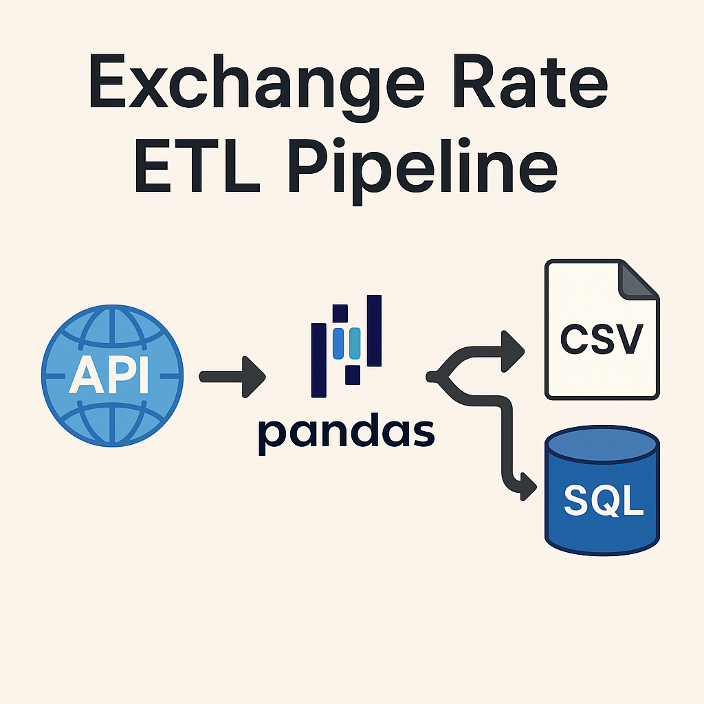

# Exchange Rate ETL Project

### 🔍 Project Overview | 工程預覽

A modular ETL (Extract-Transform-Load) pipeline that fetches daily exchange rate data from an API, transforms it using pandas, and stores the result into both a CSV file and a MySQL database. Designed with scalability, automation, and future deployment in mind.

這是一個基於 Python 的自動化貿易治策系統，自動據 API 擱取幣別平價，轉換資料，庫存於 MySQL 與 CSV，擁有優化綱絡、設定可移植化、適合 Docker 部署與零件訓練使用。

---

## 🔄 ETL Workflow Structure

```
exchange-rate-etl/
├── main.py                # Entry point to run the ETL pipeline
├── etl/
│   ├── extract.py        # Fetches raw exchange rate data via API
│   ├── transform.py      # Normalizes, flattens, and cleans the data
│   └── load.py           # Saves the data to CSV and MySQL
├── .env                  # Secure DB credentials (not committed to Git)
├── requirements.txt      # Python dependency list
├── Dockerfile (planned)  # To containerize the ETL process
└── README.md             # Project documentation (this file)
```

---

## ⚙️ How to Use | 使用指南

### 1. Install dependencies

```bash
pip install -r requirements.txt
```

### 2. Setup environment variables

Create a `.env` file:

```env
DB_HOST=localhost
DB_USER=root
DB_PASSWORD=your_password
DB_NAME=exchange_db
DB_PORT=3306
```

### 3. Run the ETL pipeline

```bash
python main.py
```

---

## 💡 Core Features | 核心特色

* ✅ Modular ETL: clean separation of extract / transform / load
* ✅ Environment-based DB connection via `.env`
* ✅ Automatic date-based deduplication before inserting into MySQL
* ✅ Historical data accumulation supported (`append` mode)
* ✅ Logging-based status tracking
* ✅ Easy integration with Docker and cron (for automation)

---

## 📊 Data Sample | 資料格式

| base\_currency | date       | currency | rate  |
| -------------- | ---------- | -------- | ----- |
| USD            | 2025-05-14 | EUR      | 0.91  |
| USD            | 2025-05-14 | JPY      | 153.2 |

---

## 🚀 Future Extensions | 展望擴充

* [ ] ⏰ Add `schedule` or `cron` to run daily
* [ ] 🌐 Add Plotly visualizations for rate trends
* [ ] 📧 Auto-email reports of latest rates (CSV + summary)
* [ ] 🚧 Create `Dockerfile` for full containerized deployment
* [ ] 💾 Add GitHub Actions CI to run automated tests on push

---

## 📈 Tech Stack

* Python 3.12+
* pandas, requests
* sqlalchemy + PyMySQL
* dotenv
* MySQL 8+

---

## 📢 Contribution / Contact

Maintained by **Chris (Cyril Tsai)**
Feel free to fork, submit pull requests, or reach out for collaboration!
