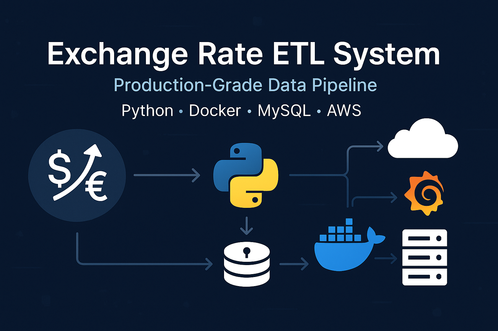
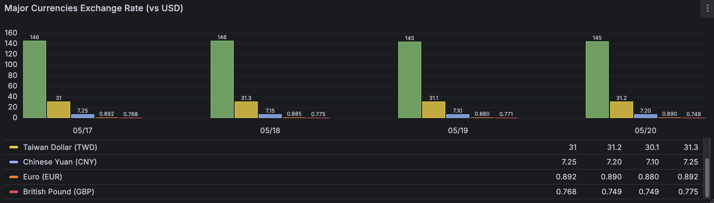

# Exchange Rate ETL System



## 🔍 Project Overview | 專案概述

A production-ready ETL (Extract-Transform-Load) system that automatically collects daily exchange rates from external APIs, processes the data using pandas, and persists it to both CSV files and a MySQL database. The architecture follows industry best practices with containerization, scheduled execution, and data visualization—designed for reliability, scalability, and operational excellence.

這是一套生產級別的匯率 ETL (擷取-轉換-載入) 系統，能夠自動從外部 API 擷取每日匯率資料，使用 pandas 進行資料處理，並將結果持久化至 CSV 檔案及 MySQL 資料庫。系統架構採用業界最佳實踐，包含容器化部署、排程執行及資料視覺化，專為可靠性、可擴展性和卓越運維而設計。

---

## 🏗️ System Architecture | 系統架構

```
exchange-rate-etl/
├── main.py                # Pipeline entry point | 管道入口點
├── etl/
│   ├── extract.py        # API data retrieval module | API 資料擷取模組
│   ├── transform.py      # Data normalization and cleaning | 資料正規化與清理
│   └── load.py           # Data persistence with CSV/MySQL writers | CSV/MySQL 資料持久化
├── docker-compose.yml    # Multi-container orchestration | 多容器協調配置
├── Dockerfile            # ETL container configuration | ETL 容器配置
├── Dockerfile.scheduler  # Scheduler container configuration | 排程器容器配置
├── grafana/              # Visualization dashboards and configurations | 視覺化儀表板與配置
├── schema.sql            # Database schema definition | 資料庫結構定義
├── run.daily.py          # Automated execution scheduler | 自動化執行排程器
├── requirements.txt      # Dependency management | 相依性管理
└── .env.docker          # Environment configuration (containerized) | 環境配置 (容器化)
```

---

## 🔄 Data Flow Architecture | 資料流程架構

```
┌────────────┐    ┌────────────┐    ┌────────────┐    ┌────────────┐
│  External  │    │            │    │            │    │   MySQL    │
│  Exchange  │───▶│  Extract   │───▶│ Transform  │───▶│  Database  │
│  Rate API  │    │            │    │            │    │            │
└────────────┘    └────────────┘    └────────────┘    └────────────┘
                                                           │
                                                           ▼
                                                    ┌────────────┐
                                                    │  Grafana   │
                                                    │ Dashboards │
                                                    └────────────┘
```

---

## ⚙️ Deployment & Usage | 部署與使用

### Local Development | 本地開發

```bash
# Install dependencies | 安裝相依套件
pip install -r requirements.txt

# Configure environment | 配置環境
cp .env.example .env
# Edit .env with your database credentials | 編輯 .env 填入資料庫憑證

# Run ETL process | 執行 ETL 處理程序
python main.py
```

### Docker Deployment | Docker 部署

```bash
# Start all services | 啟動所有服務
docker-compose up -d --build

# View logs | 查看日誌
docker logs exchange-etl
docker logs exchange-scheduler

# Access visualization | 存取視覺化介面
# Open http://localhost:3000 in browser (default credentials: admin/admin)
# 在瀏覽器中開啟 http://localhost:3000 (預設憑證: admin/admin)
```

### AWS Cloud Deployment | AWS 雲端部署

The system is designed to be deployed on AWS EC2 instances with proper security configurations:

系統設計為可部署於 AWS EC2 執行個體，並具有適當的安全配置：

1. Clone repository to EC2 instance | 將程式碼庫複製到 EC2 執行個體
2. Configure security groups (limit SSH access) | 配置安全群組 (限制 SSH 存取)
3. Deploy using docker-compose | 使用 docker-compose 進行部署
4. Schedule daily updates using the scheduler container | 使用排程器容器設定每日更新

---

## 💡 Core Features | 核心功能

* ✅ **Modular Architecture | 模組化架構**: Clean separation of concerns with extract/transform/load components | 關注點分離的 ETL 組件設計
* ✅ **Containerized Deployment | 容器化部署**: Docker-based system with multi-container orchestration | 基於 Docker 的多容器協調系統
* ✅ **Automated Scheduler | 自動化排程**: Daily data collection at configurable intervals | 可配置間隔的每日資料收集
* ✅ **Data Visualization | 資料視覺化**: Grafana dashboards for exchange rate trends and analytics | 匯率趨勢與分析的 Grafana 儀表板
* ✅ **Cloud Deployment Ready | 雲端部署就緒**: Optimized for AWS EC2 deployment | 針對 AWS EC2 部署最佳化
* ✅ **Security Focused | 安全性導向**: Proper credential management and network isolation | 適當的憑證管理與網路隔離
* ✅ **Historical Data Preservation | 歷史資料保存**: Maintains full history of exchange rates | 維護完整的匯率歷史記錄
* ✅ **Comprehensive Logging | 全面日誌記錄**: Detailed execution tracking and error handling | 詳細的執行追蹤與錯誤處理

---

## 📊 Data Visualization | 資料視覺化

The system includes customized Grafana dashboards that provide:

系統包含客製化的 Grafana 儀表板，提供：

* **Exchange Rate Trends | 匯率趨勢**: Interactive time-series visualization of major currencies | 主要貨幣的互動式時間序列視覺化
* **Current Rates | 當前匯率**: Real-time display of latest exchange rates | 最新匯率的即時顯示
* **Historical Data Tables | 歷史資料表**: Complete record of collected exchange rate data | 收集的匯率資料完整記錄
* **Custom Filtering | 自訂過濾**: Currency-specific views and time range selection | 特定貨幣視圖與時間範圍選擇



---

## 🛠️ Technology Stack | 技術堆疊

* **Backend | 後端**: Python 3.12+, pandas, SQLAlchemy
* **Data Persistence | 資料持久化**: MySQL 8+, CSV
* **API Communication | API 通訊**: Requests library with error handling | 具錯誤處理的 Requests 庫
* **Containerization | 容器化**: Docker, Docker Compose
* **Scheduling | 排程**: Python scheduler with cron-like syntax | 具 cron 語法的 Python 排程器
* **Visualization | 視覺化**: Grafana with MySQL data source | 使用 MySQL 資料源的 Grafana
* **Configuration | 配置**: Environment-based with dotenv | 基於環境變數的 dotenv 配置
* **Cloud Infrastructure | 雲端基礎架構**: AWS EC2 compatible | 相容於 AWS EC2

---

## 🚀 Future Enhancements | 未來強化

* [ ] ⚡ Performance optimization for large-scale data processing | 大規模資料處理的效能優化
* [ ] 🔔 Alert system for significant exchange rate changes | 重大匯率變化的警報系統
* [ ] 🔒 Enhanced security with encryption and user management | 加強的加密與使用者管理安全性
* [ ] 🌐 Additional data sources for comprehensive market coverage | 更全面市場覆蓋的額外資料來源
* [ ] 📊 Advanced analytics with machine learning predictions | 具機器學習預測的進階分析
* [ ] 🔄 CI/CD pipeline with automated testing and deployment | 自動化測試與部署的 CI/CD 管道
* [ ] 📱 Mobile-friendly dashboard for on-the-go monitoring | 適合行動裝置的監控儀表板

---

## 📈 Implementation Details | 實作細節

### ETL Process | ETL 流程

1. **Extract | 擷取**: Fetches exchange rate data from reliable external APIs | 從可靠的外部 API 擷取匯率資料
2. **Transform | 轉換**: Normalizes data format, handles missing values, validates integrity | 正規化資料格式、處理遺漏值、驗證完整性
3. **Load | 載入**: Persists data to CSV for backup and MySQL for querying and visualization | 將資料持久化至 CSV 做備份與 MySQL 用於查詢和視覺化

### Containerization | 容器化

Utilizes Docker multi-container architecture with:
採用 Docker 多容器架構，包含：

- MySQL container for persistent data storage | 用於持久性資料儲存的 MySQL 容器
- ETL container for data processing | 用於資料處理的 ETL 容器
- Scheduler container for automated execution | 用於自動化執行的排程器容器
- Grafana container for visualization | 用於視覺化的 Grafana 容器

### Scheduling | 排程

Implements intelligent scheduling with:
實作智慧型排程，具有：

- Configurable execution time (default: daily at 09:00) | 可配置的執行時間（預設：每日 09:00）
- Error handling and retry mechanisms | 錯誤處理與重試機制
- Logging of execution status | 執行狀態的日誌記錄

---

## 📢 Maintainer Information | 維護者資訊

Designed and implemented by **Chris (Cyril Tsai)** 
設計與實作：**Chris (Cyril Tsai)**

Project demonstrates expertise in:
專案展示的專業知識領域：

- Data Engineering | 資料工程
- ETL Pipeline Development | ETL 管道開發
- Container Orchestration | 容器協調
- Database Management | 資料庫管理
- Data Visualization | 資料視覺化
- Cloud Deployment | 雲端部署

For collaborations, contributions, or inquiries, please contact through GitHub or professional channels.
合作或諮詢，請透過 GitHub 或專業管道聯繫。